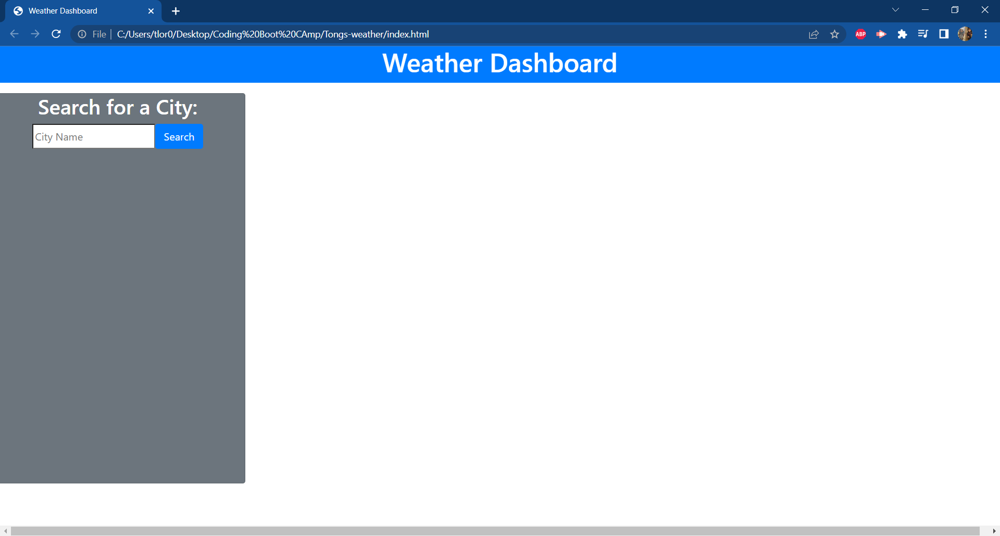
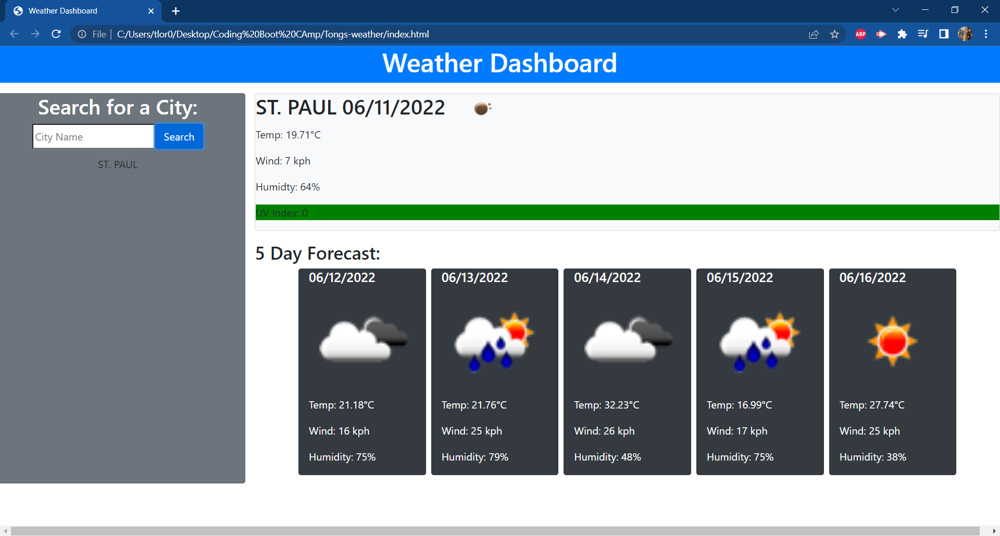

Web API - Weather Page

USAGE:
For Code, CSS and JS please use this link: https://github.com/tlor0026/Tongs-weather
For the Deployed Weather Page itself please use this link: https://tlor0026.github.io/Tongs-weather/

Ever wonder what the weather would be like in another place? Feel free to use my weather forcast page to see what the weather is in different areas!

Use the link above to get the page. We've added a serch bar for you to insert a city. 
Click on the "search" to show what the weather is like in that city along with its 5 day forcast.
We've also provided a past list located under the search bar for your convience!

Main Page!

How it looks after search + past search history!

Original framework

Initial framework mapped out!

Credits. 
As always our boot camp module is a great deal of help -https://umn.bootcampcontent.com/University-of-Minnesota-Boot-Camp/UofM-VIRT-BO-FSF-PT-04-2022-U-B

W3schools(https://www.w3schools.com/) has been a key part in helping me understand what syntax works best and how it works in my Script.
jQuery https://jquery.com/ is what i used to understand how to make things work.
Mdn web docs https://developer.mozilla.org/en-US/docs/Learn is always awesome in helping me plan and work though tough situations.
Open Weather API https://openweathermap.org/api/one-call-api was great for providing me with a Key to finish this work! They had great documentation!
